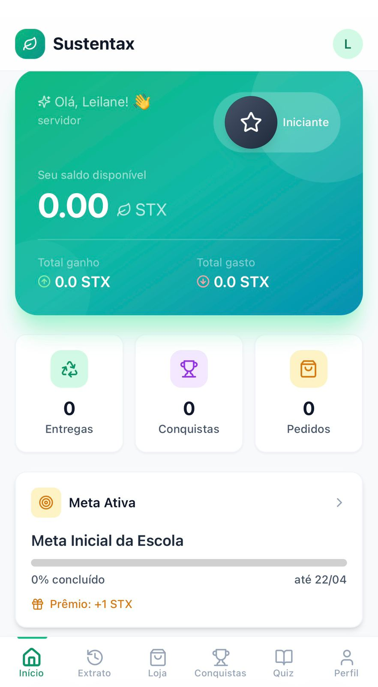
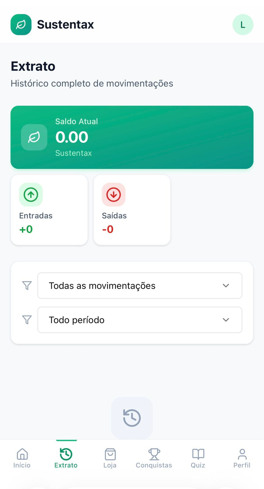
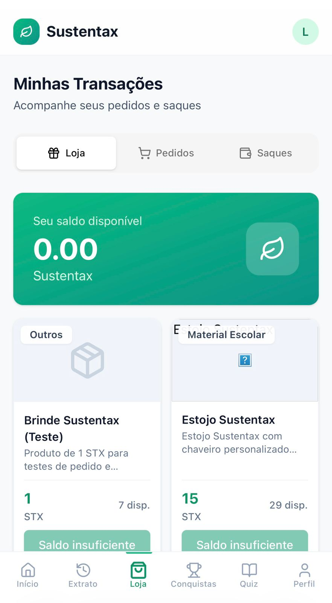
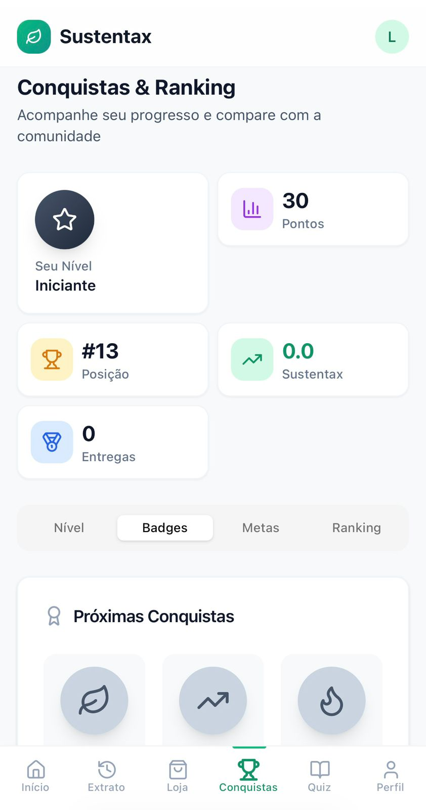
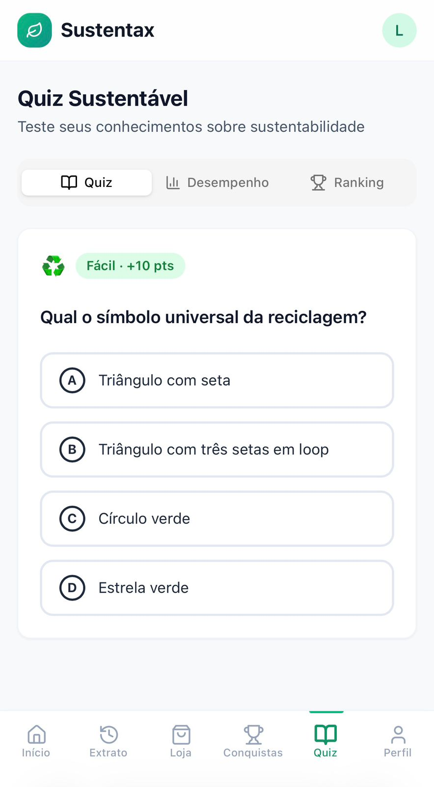

  
  
  

<h1 align="center">🌱 Sustentax</h1>

<b>Educação, tecnologia e transformação socioambiental real</b>

---

## 🌎 Visão Geral

O **Sustentax** é uma iniciativa educacional inovadora desenvolvida na **Escola Classe Paraná – DF (Brasil)** que integra **educação ambiental, economia circular e tecnologia** para promover impacto socioambiental mensurável.

A proposta transforma resíduos em aprendizado, engajamento e valor social, conectando escola, comunidade e sustentabilidade de forma prática e escalável.

---

## 🎯 Objetivo

Promover a **educação ambiental**, a **economia circular** e o **protagonismo estudantil** por meio de práticas reais, mensuráveis e replicáveis.

---

## ⚙️ Como Funciona

1. A comunidade escolar realiza a **entrega de resíduos recicláveis**  
2. Os materiais são **pesados e registrados no sistema**  
3. O valor é convertido em **moeda socioambiental (Sustentax - STX)**  
4. Os estudantes utilizam o saldo em:

- 🛒 Mercadinho Social  
- 🎉 Eventos escolares  
- 💰 Conversão ao final do ano  

---

## 🚀 Diferenciais

- ♻️ Uso de **moeda socioambiental (STX)**
- 🏫 Integração com o **currículo escolar**
- 📊 Uso de **dados reais em sala de aula**
- 👥 Forte **engajamento comunitário**
- 🌍 Modelo **replicável para outras escolas públicas**
- 💡 Integração entre **tecnologia e prática pedagógica**

---

## 📊 Impacto

- ♻️ Mais de **20 toneladas de resíduos** coletados  
- 🛢️ Mais de **1000 litros de óleo reciclado**  
- 👨‍👩‍👧‍👦 Impacto direto em **mais de 2000 pessoas**  
- 🏫 Envolvimento de **toda a comunidade escolar**  

---

## 🎥 Vídeo institucional

📽️ Conheça na prática como o Sustentax transforma educação e sustentabilidade:

👉 https://youtu.be/BiCk2u3SVs4

---

## 🏫 Instituição

**Escola Classe Paraná – DF (Brasil)**  
Projeto pedagógico voltado à sustentabilidade, inovação e inclusão.

---

## 👨‍💼 Desenvolvimento

Aplicativo desenvolvido por **Wellington de Oliveira Soares**  
Gestor escolar e idealizador do projeto Sustentax  

Cedido para uso da Associação de Pais e Mestres da Escola Classe Paraná – DF.

---

## 🔒 Observação

Este repositório possui caráter **institucional e demonstrativo**, com foco na apresentação da proposta pedagógica, em seu funcionamento e nos resultados alcançados.

🔐 O código-fonte completo do aplicativo encontra-se em ambiente privado, garantindo segurança, integridade e controle da solução.

---

## 🌱 Sustentax na prática

Uma iniciativa que integra educação, sustentabilidade e tecnologia, promovendo aprendizagem significativa, engajamento comunitário e impacto socioambiental mensurável.

---

## 🌍 Alinhamento com os ODS

- 🎯 ODS 4 — Educação de Qualidade  
- 🌱 ODS 11 — Cidades Sustentáveis  
- ♻️ ODS 12 — Consumo Responsável  
- 🌎 ODS 13 — Ação Climática  

---

## 🚀 Replicabilidade

O Sustentax foi concebido como um **modelo replicável**, podendo ser implementado em:

- Escolas públicas  
- Redes de ensino  
- Projetos comunitários  
- Programas governamentais  

---

## 🤝 Parcerias e Apoio

- Secretaria de Educação do DF  
- Associação de Pais e Mestres  
- Fundo da Embaixada da Nova Zelândia  

---

## ⭐ Mensagem final

**Recicle, acumule Sustentax e transforme o mundo — começando pela sua comunidade! 🌎♻️**

---

## 📱 Sustentax na prática — evidência de uso real

   
  <strong>Tela inicial:</strong> visualização do saldo em Sustentax, metas ativas e indicadores de engajamento do estudante.

   
  <strong>Extrato:</strong> acompanhamento detalhado das movimentações, promovendo transparência e controle do saldo.

   
  <strong>Transações:</strong> registro das ações realizadas pelo usuário, garantindo rastreabilidade das práticas sustentáveis.

   
  <strong>Conquistas e ranking:</strong> sistema de gamificação que incentiva a participação e o engajamento socioambiental.

   
  <strong>Quiz sustentável:</strong> recurso pedagógico interativo para consolidação de conhecimentos em educação ambiental.

---

### 💡 Funcionalidades do aplicativo

- 📊 Controle de saldo em Sustentax  
- ♻️ Registro de entregas de resíduos  
- 🏆 Sistema de conquistas e ranking  
- 📱 Interface simples e acessível para estudantes  
- 🌱 Educação ambiental na prática  
